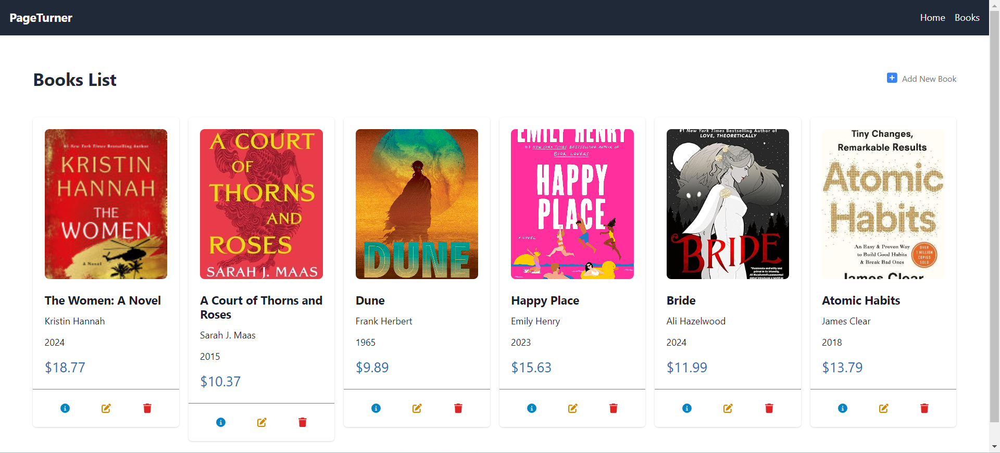

# PageTurner

PageTurner is a simple CRUD (Create, Read, Update, Delete) MERN (MongoDB, Express.js, React.js, Node.js) application for managing a bookstore. It allows users to browse, add, edit, and delete books from the bookstore collection.



## Table of Contents

- [Features](#features)
- [Technologies](#technologies)
- [Getting Started](#getting-started)
- [Usage](#usage)
- [License](#license)

## Features

- [x] Browse books
- [x] Add books
- [x] Edit books
- [x] Delete books

## Technologies

- React.js
- Node.js
- Express.js
- MongoDB
- Tailwind CSS

## Getting Started

### Prerequisites

Before running the application, make sure you have the following installed:

- Node.js
- MongoDB or MongoDB Atlas account

### Installation

1. Clone the repository

```bash
git clone https://github.com/tarek-gritli/page-turner.git
```

2. Go to the project directory and install dependencies for both the frontend and backend

```bash
cd frontend
npm install
```

```bash
cd backend
npm install
```

3. Create a `.env` file in the `backend` directory and add the environment variables as shown in the `.env.example` file.
4. Start the server

```bash
cd backend
npm start
```

5. Start the client

```bash
cd frontend
npm run dev
```


## Usage

- Browse books: View the list of available books on the books list page.
- Add Book: Click on the "Add New Book" button to add a new book to the collection.
- Edit Book: Click on the "Edit" icon in the book card to modify its details.
- Delete Book: Click on the "Delete" icon next the book card to remove it from the collection.
- View Details: Click on the "info" icon in the book card to view more detailed information about the book.

## License

This project is licensed under the [MIT License](./LICENSE).

